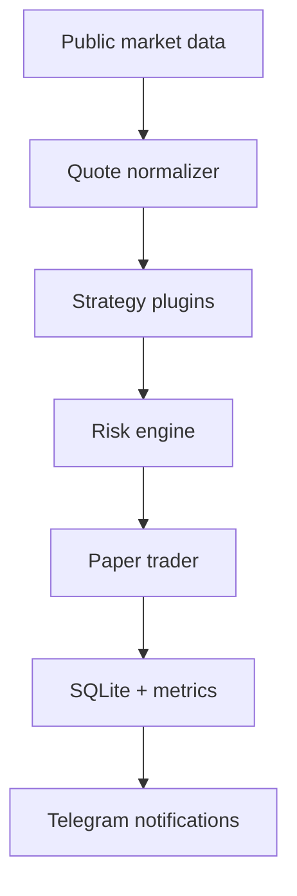

# Crypto Strategy Lab

Модульная лаборатория торговых стратегий. Любая идея сначала проходит Paper Trading,
сохраняет сделки и подтверждает качество метриками. Реальное исполнение появится только
после достаточной проверки стратегии.

> Текущий этап: **MVP-1 / только `BOT_MODE=paper`**. Биржевые API-ключи не нужны,
> настоящие ордера не создаются.

## Как это работает



Одна и та же инфраструктура обслуживает несколько стратегий:

- `latency_momentum` — ищет запаздывающую реакцию одной биржи на движение другой;
- `micro_trend` — тестирует краткосрочный импульс по быстрым и медленным средним;
- `confirmed_impulse` — требует синхронного движения двух бирж, перевеса bid-объёма
  и агрессивных покупок выше полной стоимости сделки;
- `spread_reaction` — новая оболочка для старой межбиржевой идеи с атомарным открытием
  и закрытием двух ног в Paper Trading.

Стратегии и риск-профили подключаются YAML-файлами из `strategies/`. Чтобы выключить
гипотезу, достаточно указать `enabled: false` — код ядра менять не нужно.

## Что уже реализовано

- публичные WebSocket-котировки через `ccxt.pro` и REST fallback;
- размеры top-of-book и rolling buy/sell flow публичных сделок;
- единый нормализованный формат bid/ask с контролем времени котировки;
- загрузчик стратегий из YAML;
- консервативный и агрессивный риск-профили;
- ограничение количества позиций, экспозиции, дневного убытка и частоты входов;
- Paper Trader для long/short с комиссиями, проскальзыванием, stop loss,
  take profit и maximum hold time;
- атомарные парные входы: если риск-фильтр отклоняет одну ногу, не открывается ни одна;
- SQLite-журнал закрытых сделок с восстановлением статистики после перезапуска;
- PnL, Win Rate, Profit Factor, Max Drawdown, Average Hold Time, trade-level Sharpe,
  Expectancy, средняя прибыль и средний убыток;
- Telegram-уведомления о запуске, новых paper-сигналах, закрытии и статистике;
- селектор торговой вселенной: общие spot-USDT пары, ликвидность, глубина стакана,
  исторический spread и проверка схождения после полных paper-расходов;
- автоматические тесты и GitHub Actions.

## Быстрый запуск на Windows

Требуется Python 3.12.

```powershell
py -3.12 -m venv .venv
.venv\Scripts\python -m pip install -r requirements-dev.txt
Copy-Item .env.sample .env
.venv\Scripts\python -m pytest -q tests
.venv\Scripts\python -m app.main
```

Для Telegram заполни в `.env`:

```dotenv
TELEGRAM_TOKEN=токен_бота
TELEGRAM_CHAT_IDS=твой_chat_id
```

Без этих значений приложение нормально работает только с локальными логами и SQLite.

## Отбор торговых пар

BTC и ETH удобны для проверки инфраструктуры, но межбиржевые расхождения на них обычно
слишком малы. Отдельный research-скрипт ищет более подходящую торговую вселенную:

1. оставляет активные spot-USDT пары, общие для всех выбранных бирж;
2. проверяет минимальный суточный объём на каждой бирже;
3. измеряет худшую глубину bid/ask в диапазоне 10 bps от лучшей цены;
4. загружает OHLCV и воспроизводит старую оценку spread по `(high + low) / 2`;
5. вычитает полный paper round trip: четыре комиссии и четыре проскальзывания;
6. проверяет, приносило ли последующее схождение положительный результат;
7. сохраняет прозрачный рейтинг в `runtime/universe_candidates.csv`.

Базовый запуск на Windows:

```powershell
.venv\Scripts\python -m app.research.select_universe `
  --days 14 `
  --timeframe 15m `
  --history-pairs 40 `
  --top 8
```

Скрипт напечатает готовую строку `SYMBOLS=...`, но не изменит конфигурацию. Если рейтинг
устраивает, можно повторить запуск с `--write-env` либо вручную перенести строку в `.env`.
Для более быстрого пробного прохода используй `--history-pairs 15 --days 7`.

Основные колонки отчёта:

- `p95_net_edge_bps` — 95-й перцентиль spread после полного round-trip cost;
- `opportunity_count` — число исторических наблюдений выше минимального edge;
- `mean_forward_pnl_bps` — средний результат схождения через `holding_bars` свечей;
- `forward_win_rate` — доля таких наблюдений с положительным результатом;
- `eligible` — прошла ли пара минимальные требования для Paper Trading.

OHLCV используется только как дешёвый предварительный фильтр: свечные цены разных бирж
не гарантируют одновременную исполнимость. Финальное подтверждение кандидата всегда идёт
на синхронных bid/ask через обычный Paper Trading.

## Ночная запись синхронных котировок

Для проверки кандидатов на реальных bid/ask используется отдельный recorder. Он берёт
первые пары из `runtime/universe_candidates.csv`, даже если предварительный OHLCV-фильтр
поставил им `eligible=no`, и исследует их без открытия Paper-позиций.

Останови основной бот, не давай компьютеру уйти в сон и запусти:

```powershell
.venv\Scripts\python -m app.research.record_live `
  --hours 10 `
  --symbols LIT/USDT,ONDO/USDT,TRUMP/USDT,INJ/USDT,GRAM/USDT,VIRTUAL/USDT `
  --sample-seconds 5
```

Каждую минуту recorder выводит heartbeat с количеством WebSocket-обновлений, записанных
синхронных кадров, покрытием и числом активных потоков. Через указанное время он завершится
сам. При `Ctrl+C` текущая сессия также корректно сохраняется и анализируется.

Результаты:

- `runtime/live_quotes.sqlite3` — накопленные сессии и синхронные котировки;
- `runtime/live_universe_report.csv` — сводные метрики по каждой паре;
- три консольных рейтинга: `LIVE SPREAD`, `MICRO-TREND VOLATILITY` и `LATENCY`.

Spread-рейтинг симулирует парный вход и выход на фактических bid/ask с комиссиями и
проскальзыванием. Micro-trend сравнивает движения за 1 и 5 минут с расходами одиночной
сделки. Latency считает сильные движения лидера и долю случаев, когда вторая биржа
повторила движение в течение 30 секунд.

Важно: `LATENCY RANKING` подтверждает только наблюдаемую последовательность движения.
Он не вычитает расходы из ответного движения и поэтому сам по себе не является
разрешением включать стратегию.

Если `runtime/universe_candidates.csv` отсутствует, recorder использует `SYMBOLS` из
`.env`. Пары можно задать явно через `--symbols TRUMP/USDT,GRAM/USDT`.
Новые сессии также сохраняют размеры лучших bid/ask и rolling buy/sell объём публичных
сделок за 60 секунд. Старая база мигрируется автоматически и остаётся читаемой.

## Replay micro-trend по записанным bid/ask

Recorder показывает волатильность, но ещё не доказывает, что направление сигнала можно
торговать. Replay запускает настоящую `micro_trend` на прошлых снимках без заглядывания
в будущее, исполняет вход по ask, выход по bid и вычитает комиссии и проскальзывание из
настроек Paper Trading. Котировки старше risk-порога отбрасываются.

Пример для отобранных после ночной записи пар:

```powershell
.venv\Scripts\python -m app.research.replay_microtrend `
  --symbols LIT/USDT,ONDO/USDT,TRUMP/USDT,INJ/USDT,GRAM/USDT,VIRTUAL/USDT
```

По умолчанию проверяется сетка реальных временных окон `30/60/120` секунд против
`180/300/600` секунд и пороги входа `6/12/20/30 bps`. Результат сохраняется в
`runtime/microtrend_replay.csv`: агрегированные конфигурации имеют `row_type=aggregate`,
а результаты отдельных пар и бирж — `row_type=pair`.

Лучший результат одной сессии остаётся исследовательским кандидатом. Менять рабочий
конфиг стоит только после положительной проверки на следующем независимом периоде.
Текущая MA-версия `micro_trend` выключена в YAML по умолчанию, потому что первый replay
на синхронных bid/ask не покрыл торговые издержки.

## Cost-aware latency replay

Отдельный replay превращает статистическое запаздывание в исполнимую Paper-сделку:
после движения лидера он входит по фактическому bid/ask ведомой биржи, ждёт её ответ,
stop или лимит времени и вычитает обе комиссии и slippage. Long и short проверяются
тем же Paper Trader, который используется основным приложением.

```powershell
.venv\Scripts\python -m app.research.replay_latency `
  --symbols GRAM/USDT,TRUMP/USDT,LIT/USDT
```

По умолчанию перебираются движения лидера `12/20/30 bps`, минимальные разрывы
`8/15/25 bps`, ответы ведомой биржи `8/12/20/30/40 bps` и удержание
`5/10/20/30` секунд. Результат сохраняется в `runtime/latency_replay.csv`.

Для проверки чувствительности к комиссии можно сделать отдельный исследовательский
прогон, не меняя рабочий `.env`:

```powershell
.venv\Scripts\python -m app.research.replay_latency `
  --fee-bps bybit:5,okx:5 `
  --output runtime/latency_replay_low_fee.csv
```

Низкая комиссия в таком прогоне является только контрфактическим сценарием. Она не
заменяет новую запись котировок с биржи, на которой предполагается исполнение.

## Cost-aware confirmed impulse

Новая гипотеза входит только в long, когда движение подтверждено Bybit и OKX, расхождение
между биржами невелико, а стакан и поток публичных сделок показывают перевес покупателей.
Минимальный импульс не может быть ниже суммы round-trip cost и safety margin. Стратегия
выключена по умолчанию до replay новой feature-rich сессии.

После записи запусти:

```powershell
.venv\Scripts\python -m app.research.replay_confirmed_impulse `
  --symbols LIT/USDT,ONDO/USDT,TRUMP/USDT,INJ/USDT,GRAM/USDT,VIRTUAL/USDT
```

Grid проверяет lookback `30/60/120s`, подтверждённый ход `30/40/60 bps`, два порога
book imbalance и два порога trade-flow imbalance. Replay использует фактические bid/ask,
комиссии, slippage, stop/take, cooldown и контроль свежести обеих бирж. Старые сессии без
объёмных признаков отклоняются явно, а не заполняются искусственными значениями.

## Запуск через Docker

```bash
cp .env.sample .env
docker compose up --build
```

База Paper Trading сохраняется в Docker volume `runtime_data`. Старые PostgreSQL и
Redis оставлены только для исследования legacy-пайплайна:

```bash
docker compose --profile legacy up
```

## Основная структура

```text
app/
  config/          # env-настройки и YAML loader
  domain/          # Quote, Signal, Position, ClosedTrade
  market_data/     # WebSocket, REST и normalizer
  research/        # поиск и рейтинг торговой вселенной
  strategies/      # подключаемые торговые гипотезы
  risk/            # риск-фильтры и размер позиции
  trading/         # Paper Trader
  analytics/       # SQLite и метрики
  bot/             # Telegram-уведомления
  engine.py        # оркестрация полного цикла
  main.py

strategies/        # YAML-конфиги стратегий и риск-профилей
tests/             # изолированные тесты без подключения к биржам
```

Старые каталоги `data_fetch/`, `processing/`, `pipeline/` и `realtime/` пока сохранены
как legacy: из них переносим только проверенные части, но новый runtime от них не зависит.

## Настройки Paper Trading

Основные переменные находятся в `.env.sample`:

- `PAPER_INITIAL_EQUITY` — стартовый виртуальный баланс в **USDT**;
- `PAPER_FEE_BPS` — комиссия каждой биржи в базисных пунктах;
- `PAPER_SLIPPAGE_BPS` — моделируемое проскальзывание;
- `RISK_PROFILE` — `conservative` или `aggressive`;
- `EXCHANGES` и `SYMBOLS` — источники и пары;
- `PAPER_DB_PATH` — локальная SQLite-база.

Сумма `3000 USDT` в примере — только стартовая настройка. Перед длительным тестом её
нужно заменить на фактическую сумму, которую планируется выделить после конвертации
депозита из рублей.

## Проверки

```bash
python -m ruff check app tests
python -m pytest -q tests
```

## Дальнейшие этапы

1. MVP-2: исторический replay/backtester и сравнение конфигураций стратегий.
2. MVP-3: отдельный executor, API бирж и ручное подтверждение сделки.
3. MVP-4: автоматическое исполнение только для стратегии с доказанной устойчивостью.

Это исследовательский проект, а не обещание доходности. Результаты Paper Trading не
гарантируют сохранение эффективности на реальном рынке.
