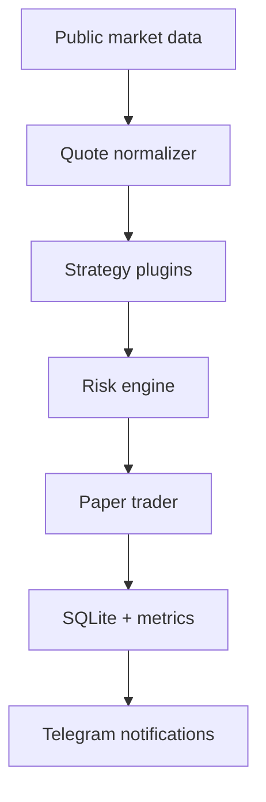

# Crypto Strategy Lab

Модульная лаборатория торговых стратегий. Любая идея сначала проходит Paper Trading,
сохраняет сделки и подтверждает качество метриками. Реальное исполнение появится только
после достаточной проверки стратегии.

> Текущий этап: **MVP-1 / только `BOT_MODE=paper`**. Биржевые API-ключи не нужны,
> настоящие ордера не создаются.

## Как это работает



Одна и та же инфраструктура обслуживает несколько стратегий:

- `latency_momentum` — ищет запаздывающую реакцию одной биржи на движение другой;
- `micro_trend` — тестирует краткосрочный импульс по быстрым и медленным средним;
- `spread_reaction` — новая оболочка для старой межбиржевой идеи с атомарным открытием
  и закрытием двух ног в Paper Trading.

Стратегии и риск-профили подключаются YAML-файлами из `strategies/`. Чтобы выключить
гипотезу, достаточно указать `enabled: false` — код ядра менять не нужно.

## Что уже реализовано

- публичные WebSocket-котировки через `ccxt.pro` и REST fallback;
- единый нормализованный формат bid/ask с контролем времени котировки;
- загрузчик стратегий из YAML;
- консервативный и агрессивный риск-профили;
- ограничение количества позиций, экспозиции, дневного убытка и частоты входов;
- Paper Trader для long/short с комиссиями, проскальзыванием, stop loss,
  take profit и maximum hold time;
- атомарные парные входы: если риск-фильтр отклоняет одну ногу, не открывается ни одна;
- SQLite-журнал закрытых сделок с восстановлением статистики после перезапуска;
- PnL, Win Rate, Profit Factor, Max Drawdown, Average Hold Time, trade-level Sharpe,
  Expectancy, средняя прибыль и средний убыток;
- Telegram-уведомления о запуске, новых paper-сигналах, закрытии и статистике;
- автоматические тесты и GitHub Actions.

## Быстрый запуск на Windows

Требуется Python 3.12.

```powershell
py -3.12 -m venv .venv
.venv\Scripts\python -m pip install -r requirements-dev.txt
Copy-Item .env.sample .env
.venv\Scripts\python -m pytest -q tests
.venv\Scripts\python -m app.main
```

Для Telegram заполни в `.env`:

```dotenv
TELEGRAM_TOKEN=токен_бота
TELEGRAM_CHAT_IDS=твой_chat_id
```

Без этих значений приложение нормально работает только с локальными логами и SQLite.

## Запуск через Docker

```bash
cp .env.sample .env
docker compose up --build
```

База Paper Trading сохраняется в Docker volume `runtime_data`. Старые PostgreSQL и
Redis оставлены только для исследования legacy-пайплайна:

```bash
docker compose --profile legacy up
```

## Основная структура

```text
app/
  config/          # env-настройки и YAML loader
  domain/          # Quote, Signal, Position, ClosedTrade
  market_data/     # WebSocket, REST и normalizer
  strategies/      # подключаемые торговые гипотезы
  risk/            # риск-фильтры и размер позиции
  trading/         # Paper Trader
  analytics/       # SQLite и метрики
  bot/             # Telegram-уведомления
  engine.py        # оркестрация полного цикла
  main.py

strategies/        # YAML-конфиги стратегий и риск-профилей
tests/             # изолированные тесты без подключения к биржам
```

Старые каталоги `data_fetch/`, `processing/`, `pipeline/` и `realtime/` пока сохранены
как legacy: из них переносим только проверенные части, но новый runtime от них не зависит.

## Настройки Paper Trading

Основные переменные находятся в `.env.sample`:

- `PAPER_INITIAL_EQUITY` — стартовый виртуальный баланс в **USDT**;
- `PAPER_FEE_BPS` — комиссия каждой биржи в базисных пунктах;
- `PAPER_SLIPPAGE_BPS` — моделируемое проскальзывание;
- `RISK_PROFILE` — `conservative` или `aggressive`;
- `EXCHANGES` и `SYMBOLS` — источники и пары;
- `PAPER_DB_PATH` — локальная SQLite-база.

Сумма `3000 USDT` в примере — только стартовая настройка. Перед длительным тестом её
нужно заменить на фактическую сумму, которую планируется выделить после конвертации
депозита из рублей.

## Проверки

```bash
python -m ruff check app tests
python -m pytest -q tests
```

## Дальнейшие этапы

1. MVP-2: исторический replay/backtester и сравнение конфигураций стратегий.
2. MVP-3: отдельный executor, API бирж и ручное подтверждение сделки.
3. MVP-4: автоматическое исполнение только для стратегии с доказанной устойчивостью.

Это исследовательский проект, а не обещание доходности. Результаты Paper Trading не
гарантируют сохранение эффективности на реальном рынке.
